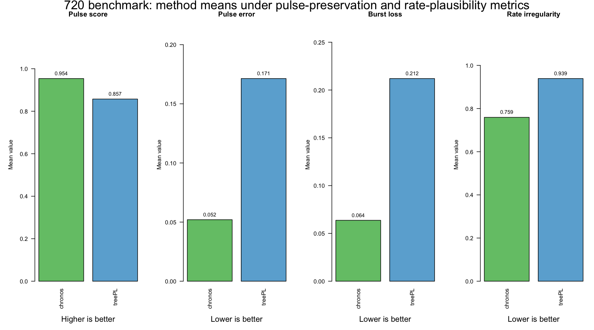

# Why Chronos and not treePL?

Because treePL is widely used for divergence-time analyses of large phylogenies, it is often the default choice. Excluding computationally intensive Bayesian methods that are impractical at this scale, this benchmark tests whether that default is warranted under the simulation conditions examined here.

I compared **treePL** and **chronos** under the same topology, calibration, and replicate grid.

- Total tests: **720** (4 true clock regimes x 3 extinction levels x 2 heterotachy levels x 30 replicates)
- Same topology and root calibration for both methods
- treePL tuning: smooth in `{0.1, 1, 10}`
- chronos tuning: model in `{clock, correlated, relaxed, discrete}`, lambda in `{0.1, 1, 10}`, robust selector

## Three layers to keep separate

This pipeline treats three things as distinct:

1. `clock fitting`
   - choosing among chronos clock models such as `clock`, `correlated`, `relaxed`, and `discrete`
2. `lambda tuning`
   - choosing the penalty/smoothing strength within the chronos search
3. `post-fit evaluation metrics`
   - evaluating the dated trees that come out of that fitting process

That distinction matters here. The original 720 benchmark is still first and foremost a method comparison based on dating accuracy and stability. The pulse, gap, and rate metrics are a separate post-fit evaluation layer. They do not replace clock fitting or lambda tuning, and they do not replace the original MAE benchmark. They help interpret how the resulting chronograms behave once fitting is already done.

## Simulation design (how tests were generated)

- Birth-death simulation used `lambda = 1` and `mu in {0, 0.5, 0.8}`.
- Trees were first simulated with target extant richness `N_FULL = 1500` tips.
- For `mu > 0`, extinct lineages were not retained in the dated dataset: extinct branches were dropped by extant-tip sampling before final pruning.
- Then each tree was randomly pruned to `N_PRUNED = 150` tips for dating/evaluation.
- True node ages came from this 150-tip pruned true tree.
- Phylograms were generated from true-time branch durations by clock-specific rate transforms:
  - `strict`: all branch rates = 1.
  - `independent`: branch rates `exp(N(0, heterotachy))`.
  - `discrete`: 3-rate categories `exp(c(-1,0,1) * 2 * heterotachy)` with probs `(0.25, 0.5, 0.25)`.
  - `autocorrelated`: child rate = parent rate `* exp(N(0, heterotachy))`, starting at root rate = 1.
- Heterotachy levels were `H in {0.05, 0.25}`.
- Calibration strategy was root-only and identical for both methods:
  - root minimum age = root maximum age = true root age.
- Hyperparameter/model search in this 720-run benchmark:
  - treePL: smooth grid `{0.1, 1, 10}`.
  - chronos: model grid `{clock, correlated, relaxed, discrete}`, lambda grid `{0.1, 1, 10}`.
  - robust chronos selector settings: `PLOG_CLOCK_SWITCH_THRESH=1`, `PLOG_NONCLOCK_SWITCH_THRESH=2`, `PLOG_TIE_EPS=2`, `K_FIT_GRID={2,3,5,10}`.

## Headline result

- Mean MAE: treePL **1.8113** vs chronos **0.4966**
- Head-to-head (both finite, n=635): chronos better in **558/635 (87.9%)**
- treePL failed to return finite MAE in **85/720** tests

## By true clock model (mean MAE; lower is better)

- strict (n both=180): treePL **1.0888** | chronos **0.0041**
- autocorrelated (n both=136): treePL **4.1675** | chronos **0.9149**
- independent (n both=160): treePL **1.1317** | chronos **0.4363**
- discrete (n both=159): treePL **1.2980** | chronos **0.6309**

## By heterotachy (mean MAE)

- H=0.05 (n both=341): treePL **1.2876** | chronos **0.0885**
- H=0.25 (n both=294): treePL **2.4188** | chronos **0.9046**

## By extinction (mu; mean MAE)

- mu=0.0 (n both=207): treePL **0.7540** | chronos **0.2256**
- mu=0.5 (n both=211): treePL **1.1017** | chronos **0.3711**
- mu=0.8 (n both=217): treePL **3.5100** | chronos **0.8930**

## Chronos model recovery (true simulated model vs selected model)

- Overall exact recovery: **313/720 (43.5%)**
- clock: **179/180 (99.4%)**
- correlated: **134/180 (74.4%)**
- discrete: **0/180 (0.0%)**
- relaxed: **0/180 (0.0%)**

This means chronos is much better on age accuracy in this benchmark, but its selector tends to collapse relaxed/discrete scenarios into clock/correlated solutions under this robust setup.

## Caveat: clock model fitting vs dating accuracy

Chronos had strong age accuracy in this benchmark, but clock-model recovery was imperfect (especially for true `discrete` and `relaxed` scenarios under this robust selector). This is an important caveat: good dating performance does not guarantee exact recovery of the generating clock model.

That caveat is exactly why the broader comparative framework matters. In addition to MAE and failure rate, the benchmark can also be read through post-fit evaluation metrics that ask how the resulting chronograms behave biologically after model fitting and lambda tuning are finished.

### Recovery by model (exact numbers)

- **Overall exact recovery:** `313/720 (43.5%)`
- **By true model:**
  - `clock`: `179/180 (99.4%)`
  - `correlated`: `134/180 (74.4%)`
  - `discrete`: `0/180 (0.0%)`
  - `relaxed`: `0/180 (0.0%)`
- **Main misclassification pattern (from confusion matrix):**
  - true `discrete` -> selected `correlated`: `149/180`
  - true `relaxed` -> selected `correlated`: `119/180`
  - true `relaxed` -> selected `clock`: `61/180`
  - true `discrete` -> selected `clock`: `31/180`

These recovery results are the caveat: chronos delivered better age accuracy than treePL overall, but model identification was uneven across clock regimes.

## Post-fit evaluation metrics

The benchmark is centered on MAE and failure rate, and it should still be read that way first. But the post-fit evaluation layer adds three complementary metrics that help interpret method behavior beyond raw dating error:

- `pulse preservation`
  - asks whether the dated tree keeps the same diversification rhythm as the reference tree
- `gap burden`
  - asks how much fossil-gap burden or calibration slack the dated tree implies
  - this is not usable in the 720 benchmark because the design uses only a fixed root calibration
- `rate plausibility`
  - asks whether the dated tree requires extreme or erratic branchwise rate changes

These are post-fit evaluation metrics. They are not the same thing as:

- `clock fitting`
  - selecting among chronos clock models
- `lambda tuning`
  - selecting the penalty value used during chronos fitting

They operate one step later by comparing the resulting dated trees.

For the 720 simulation outputs rescored under this post-fit evaluation layer, the interpretation remains favorable to chronos:

- `pulse preservation`: chronos better in all 24 representative-condition comparisons by `pulse_score`, and in 23/24 by `burst_loss` and `tempo_composite`
- `rate plausibility`: chronos better in 18/24 representative-condition comparisons by `rate_irregularity`
- `gap burden`: not applicable by design under root-only calibration

So these post-fit evaluation metrics do not overturn the original conclusion. They reinforce it, while adding a more biologically informative view of tree shape and implied rate behavior.

They also show that the picture is not uniform across every simulated regime. treePL still does better in some specific strata:

- `rate plausibility`, strict-clock conditions: treePL wins `5/6`, chronos wins `1/6`
- `MAE`, discrete conditions: treePL wins `2/6`, chronos wins `4/6`
- `tempo_composite`, autocorrelated conditions: treePL wins `1/6`, chronos wins `5/6`
- `rate plausibility`, autocorrelated conditions: treePL wins `1/6`, chronos wins `5/6`

Outside those specific strata, chronos wins the remaining representative-condition comparisons for the post-fit metrics summarized here.

## Figures

*Footnote:* This panel shows a representative subset only: `mu=0.8`, `H=0.25` across the four true clock regimes (strict, autocorrelated, independent, discrete). Other conditions (`mu=0`, `mu=0.5`, and `H=0.05`) are not shown here. Under the strict-clock simulation, heterotachy is not applied (`rates = 1`), so strict phylograms remain ultrametric even when `H=0.25`.

## Post-fit evaluation figures

This figure summarizes the 720 rescoring under the post-fit evaluation layer. Pulse and rate metrics are computed on one representative tree for each of the 24 simulation conditions, whereas MAE uses all replicate values.

This figure shows method means for the pulse-preservation and rate-plausibility summaries. Chronos has higher `pulse_score` and lower `pulse_error`, `burst_loss`, and `rate_irregularity` than treePL in these representative-tree comparisons.

This figure shows the places where treePL still wins and where chronos still wins within the same strata. The clearest case is `rate plausibility` under strict-clock simulations, where treePL wins `5/6` representative conditions and chronos wins `1/6`. Smaller treePL advantages also appear for `MAE` in discrete simulations (`2/6` treePL, `4/6` chronos) and for `tempo_composite` and `rate plausibility` in isolated autocorrelated conditions (`1/6` treePL, `5/6` chronos).

## Practical interpretation

- The post-fit evaluation layer still favors chronos overall: chronos wins all `24/24` representative-condition comparisons by `pulse_score`, `23/24` by `burst_loss` and `tempo_composite`, and `18/24` by `rate_irregularity`.
- The strongest exception is `rate plausibility` under strict-clock simulations, where treePL wins `5/6` representative conditions. Smaller treePL advantages also occur for `MAE` in discrete simulations and for isolated autocorrelated comparisons in `tempo_composite` and `rate plausibility`.
- `Gap burden` is not informative in this 720 benchmark because the design uses only a fixed root calibration, so the relevant post-fit evidence here is pulse preservation plus rate plausibility.
- For empirical analyses, keep clock fitting, lambda tuning, and post-fit evaluation as separate reporting layers, and present fit-based model choice together with pulse preservation, gap burden when available, and rate plausibility.

## Data files

- `by_clock_summary.csv`
- `by_mu_summary.csv`
- `by_heterotachy_summary.csv`
- `chronos_recovery_summary.csv`
- `chronos_recovery_confusion_matrix.csv`
- `data/pulse_metric_720_method_mean_summary.csv`
- `data/pulse_metric_720_wins_table.csv`
- `data/pulse_metric_720_delta_by_clock_model.csv`
- `data/pulse_metric_720_condition_paired_treepl_vs_chronos.csv`
- `data/pulse_metric_720_clock_model_wins.csv`
