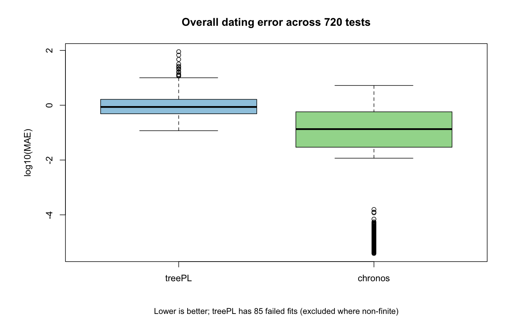
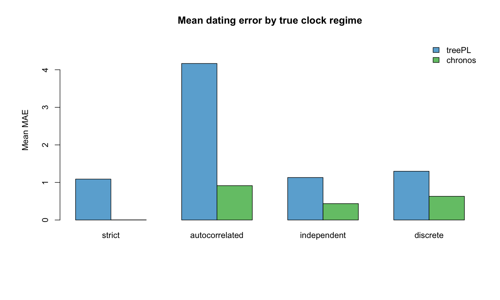
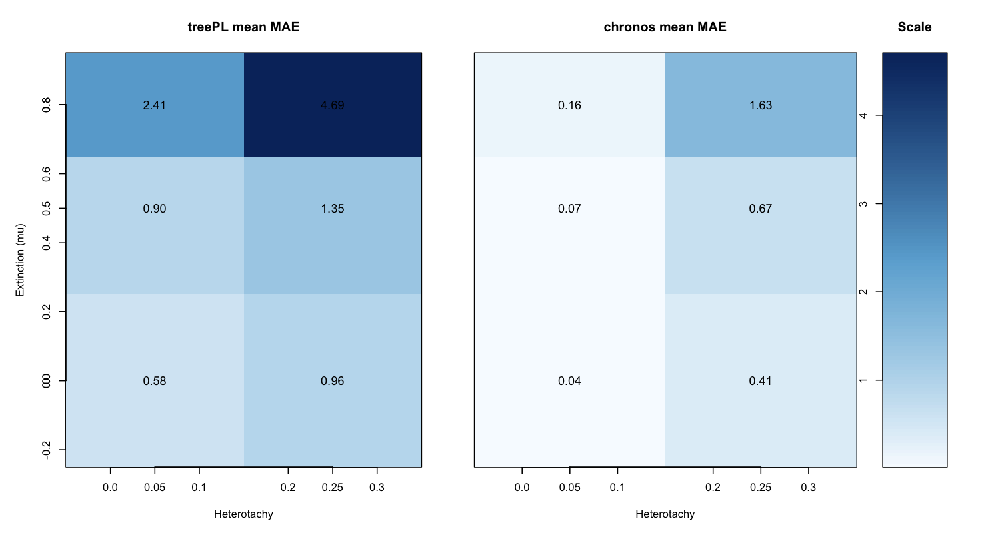
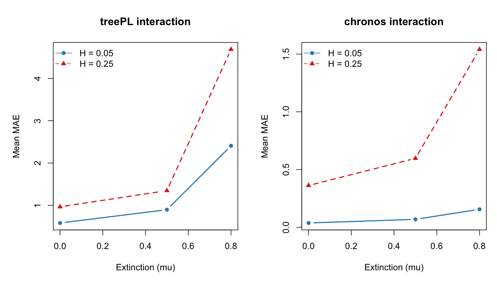
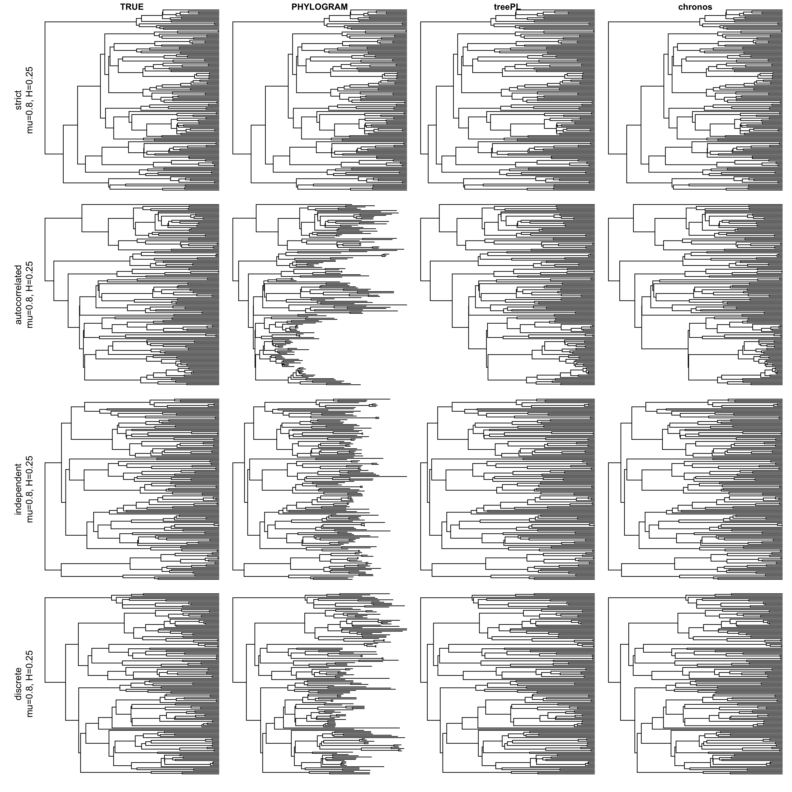

# Why Chronos and not treePL?

Because treePL is widely used for divergence-time analyses of large phylogenies, it is often the default choice. Excluding computationally intensive Bayesian methods that are impractical at this scale, this benchmark tests whether that default is warranted under the simulation conditions examined here.

I compared **treePL** and **chronos** under the same topology, calibration, and replicate grid.

- Total tests: **720** (4 true clock regimes x 3 extinction levels x 2 heterotachy levels x 30 replicates)
- Same topology and root calibration for both methods
- treePL tuning: smooth in `{0.1, 1, 10}`
- chronos tuning: model in `{clock, correlated, relaxed, discrete}`, lambda in `{0.1, 1, 10}`, robust selector

## Simulation design (how tests were generated)

- Birth-death simulation used `lambda = 1` and `mu in {0, 0.5, 0.8}`.
- Trees were first simulated with target extant richness `N_FULL = 1500` tips.
- For `mu > 0`, extinct lineages were not retained in the dated dataset: extinct branches were dropped by extant-tip sampling before final pruning.
- Then each tree was randomly pruned to `N_PRUNED = 150` tips for dating/evaluation.
- True node ages came from this 150-tip pruned true tree.
- Phylograms were generated from true-time branch durations by clock-specific rate transforms:
  - `strict`: all branch rates = 1.
  - `independent`: branch rates `exp(N(0, heterotachy))`.
  - `discrete`: 3-rate categories `exp(c(-1,0,1) * 2 * heterotachy)` with probs `(0.25, 0.5, 0.25)`.
  - `autocorrelated`: child rate = parent rate `* exp(N(0, heterotachy))`, starting at root rate = 1.
- Heterotachy levels were `H in {0.05, 0.25}`.
- Calibration strategy was root-only and identical for both methods:
  - root minimum age = root maximum age = true root age.
- Hyperparameter/model search in this 720-run benchmark:
  - treePL: smooth grid `{0.1, 1, 10}`.
  - chronos: model grid `{clock, correlated, relaxed, discrete}`, lambda grid `{0.1, 1, 10}`.
  - robust chronos selector settings: `PLOG_CLOCK_SWITCH_THRESH=1`, `PLOG_NONCLOCK_SWITCH_THRESH=2`, `PLOG_TIE_EPS=2`, `K_FIT_GRID={2,3,5,10}`.

## Headline result

- Mean MAE: treePL **1.8113** vs chronos **0.4966**
- Head-to-head (both finite, n=635): chronos better in **558/635 (87.9%)**
- treePL failed to return finite MAE in **85/720** tests

## By true clock model (mean MAE; lower is better)

- strict (n both=180): treePL **1.0888** | chronos **0.0041**
- autocorrelated (n both=136): treePL **4.1675** | chronos **0.9149**
- independent (n both=160): treePL **1.1317** | chronos **0.4363**
- discrete (n both=159): treePL **1.2980** | chronos **0.6309**

## By heterotachy (mean MAE)

- H=0.05 (n both=341): treePL **1.2876** | chronos **0.0885**
- H=0.25 (n both=294): treePL **2.4188** | chronos **0.9046**

## By extinction (mu; mean MAE)

- mu=0.0 (n both=207): treePL **0.7540** | chronos **0.2256**
- mu=0.5 (n both=211): treePL **1.1017** | chronos **0.3711**
- mu=0.8 (n both=217): treePL **3.5100** | chronos **0.8930**

## Chronos model recovery (true simulated model vs selected model)

- Overall exact recovery: **313/720 (43.5%)**
- clock: **179/180 (99.4%)**
- correlated: **134/180 (74.4%)**
- discrete: **0/180 (0.0%)**
- relaxed: **0/180 (0.0%)**

This means chronos is much better on age accuracy in this benchmark, but its selector tends to collapse relaxed/discrete scenarios into clock/correlated solutions under this robust setup.

## Caveat: clock model fitting vs dating accuracy

Chronos had strong age accuracy in this benchmark, but clock-model recovery was imperfect (especially for true `discrete` and `relaxed` scenarios under this robust selector). This is an important caveat: good dating performance does not guarantee exact recovery of the generating clock model.

To make empirical model choice more transparent, I also added a complementary **Branching-Tempo Metric** workflow that compares how well candidate chronograms preserve branching-tempo structure from the input phylogram. See: [Branching-Tempo Metric Guide](../2_CHRONOS_CUSTOM_DATING_TREE_PIPELINE/BRANCHING_TEMPO_METRIC_GUIDE.md).

### Recovery by model (exact numbers)

- **Overall exact recovery:** `313/720 (43.5%)`
- **By true model:**
  - `clock`: `179/180 (99.4%)`
  - `correlated`: `134/180 (74.4%)`
  - `discrete`: `0/180 (0.0%)`
  - `relaxed`: `0/180 (0.0%)`
- **Main misclassification pattern (from confusion matrix):**
  - true `discrete` -> selected `correlated`: `149/180`
  - true `relaxed` -> selected `correlated`: `119/180`
  - true `relaxed` -> selected `clock`: `61/180`
  - true `discrete` -> selected `clock`: `31/180`

These recovery results are the caveat: chronos delivered better age accuracy than treePL overall, but model identification was uneven across clock regimes.

## Figures

*Footnote:* This panel shows a representative subset only: `mu=0.8`, `H=0.25` across the four true clock regimes (strict, autocorrelated, independent, discrete). Other conditions (`mu=0`, `mu=0.5`, and `H=0.05`) are not shown here. Under the strict-clock simulation, heterotachy is not applied (`rates = 1`), so strict phylograms remain ultrametric even when `H=0.25`.

## Practical interpretation

- For these conditions, chronos is the better default for dating accuracy and stability.
- treePL can still be informative, but it degrades strongly in harder regimes.
- For empirical analyses, keep model-sensitivity reporting explicit even when chronos is used as the primary method, and report both fit-based model choice and branching-tempo diagnostics.

## Data files

- `by_clock_summary.csv`
- `by_mu_summary.csv`
- `by_heterotachy_summary.csv`
- `chronos_recovery_summary.csv`
- `chronos_recovery_confusion_matrix.csv`
