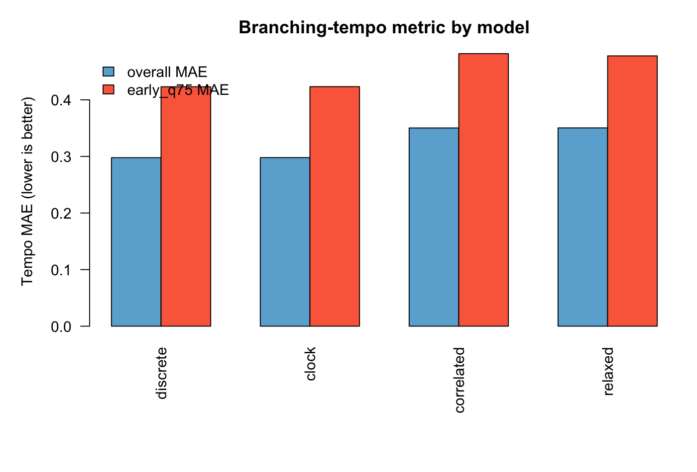

# Pulse-Preservation Metric Guide (Example Output)

This page shows why the pulse-preservation metric is useful for tree selection beyond clock-model fit alone.

## What this diagnostic adds

Clock-model fit (`PHIIC` / penalized likelihood) answers: *which model fits the branch-length process best under the chronos objective*.

Pulse preservation answers a different question: *which dated tree preserves the diversification pulse pattern seen in the input phylogram*.

Using both helps avoid choosing a tree that is statistically favored but biologically implausible for your clade's tempo history.

## Example files used

- Input phylogram: `2_CHRONOS_CUSTOM_DATING_TREE_PIPELINE/EXAMPLE_FILES/OUTPUT_DEMO/TERAP_ML_MAIN_phylogram_used.tree`
- Model trees: `.../TERAP_ML_MAIN_chronos_dated_model{clock,correlated,relaxed,discrete}.tre`
- Summary table: `2_CHRONOS_CUSTOM_DATING_TREE_PIPELINE/EXAMPLE_FILES/OUTPUT_DEMO/summary_terap_empirical_model_fits.csv`

## Ranked pulse results (lower is better for the error summaries)

From the example output:

1. **discrete**: `tempo_mae_all = 0.2978`, `tempo_mae_early_q75 = 0.4231` (best)
2. **clock**: `tempo_mae_all = 0.2979`, `tempo_mae_early_q75 = 0.4233` (near-tie with best)
3. **relaxed**: `tempo_mae_all = 0.3504`, `tempo_mae_early_q75 = 0.4777`
4. **correlated**: `tempo_mae_all = 0.3503`, `tempo_mae_early_q75 = 0.4816`

Interpretation for this example: the two lowest-metric trees (discrete, clock) preserve phylogram burst structure much better than the two highest-metric trees (relaxed, correlated).

## Figure A: Tree-shape comparison (best vs worst)

How to read:

- All trees are normalized to comparable root-to-tip scale.
- The best two metric trees retain burst placement more similarly to the input phylogram than the worst two.
- Arrows show clades with diversification pulses in the phylogram that are preserved only in the best two chronograms (discrete, clock).

## Figure B: Metric comparison by model

This summarizes the overall and early pulse-error summaries used to rank models.

## Practical decision rule

For empirical trees, use both layers:

1. Fit-layer: robust model selector from chronos fit statistics.
2. Pulse layer: pulse-preservation metric to check biological plausibility of diversification pulses.

If they agree, selection is straightforward.
If they disagree, report both and justify final choice using clade-specific biological context.

## Reproducibility

- Figure script: `2_CHRONOS_CUSTOM_DATING_TREE_PIPELINE/scripts/make_branching_tempo_guide_figures.R`
- Ranked table produced by script:
  - `2_CHRONOS_CUSTOM_DATING_TREE_PIPELINE/EXAMPLE_FILES/OUTPUT_DEMO/summary_terap_empirical_model_fits_ranked.csv`
