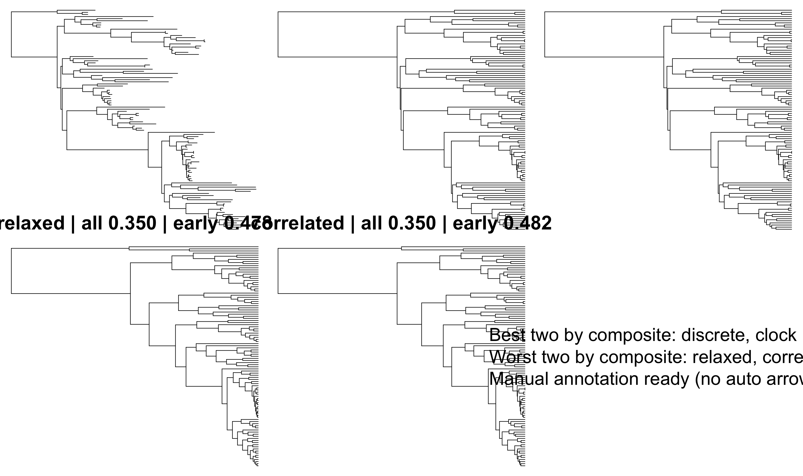
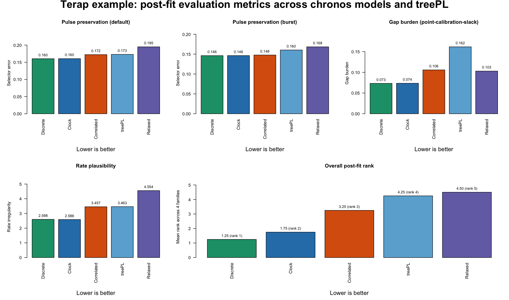

# Post-Fit Evaluation Metrics Guide (Terap Example Output)

This page is about one question: after `clock fitting` and `lambda tuning` are finished, which dated tree looks best in the Terap example?

## Quick takeaway

- `chronos_discrete` is the best overall tree in the Terap post-fit comparison
- `chronos_clock` is a near-tie second and is the best tree for `rate plausibility`
- `treePL` is not the top solution in this example
- `Figure A` is only for the pulse issue; `Figure B` is the broader post-fit comparison

## Three layers

The pipeline keeps three layers separate:

- `clock fitting`: which chronos model is preferred by the fit statistics
- `lambda tuning`: which smoothing strength is preferred within the model search
- `post-fit evaluation`: which final dated tree looks best biologically

This page is about that third layer. It uses three metric families:

- `pulse preservation`
- `gap burden`
- `rate plausibility`

## Terap example: fit layer vs post-fit layer

Fit and post-fit point in a similar direction here, but not in exactly the same way. `clock` has the best `PHIIC` in the fit summary. `discrete` has the best penalized log-likelihood and the best overall post-fit rank. So this is not a case where one model wins everything. It is a case where `clock` and `discrete` are the two strongest chronos candidates, but for different reasons.

## Ranked post-fit results (lower is better)

In this Terap example, `gap burden` behaves as `point-calibration slack`, not as fossil-minimum ghost-lineage burden, because the comparison uses point calibrations.

| candidate | pulse preservation (default) | pulse preservation (burst) | gap burden | rate plausibility | overall mean rank |
| --- | ---: | ---: | ---: | ---: | ---: |
| `chronos_discrete` | `0.1603` | `0.1462` | `0.0733` | `2.5982` | `1.25` |
| `chronos_clock` | `0.1605` | `0.1464` | `0.0736` | `2.5861` | `1.75` |
| `chronos_correlated` | `0.1722` | `0.1478` | `0.1058` | `3.4566` | `3.25` |
| `treePL` | `0.1729` | `0.1604` | `0.1615` | `3.4631` | `4.25` |
| `chronos_relaxed` | `0.1949` | `0.1684` | `0.1030` | `4.5535` | `4.50` |

In short: `chronos_discrete` leads both pulse summaries and `gap burden`, while `chronos_clock` leads `rate plausibility`.

## Figure A: Pulse-layer tree-shape comparison among bundled chronos trees

This figure is useful because it shows the pulse layer directly on the bundled `chronos` trees only; `treePL` is not shown in this panel. It helps explain why `discrete` and `clock` sit at the top of the pulse-preservation ranking. But this panel is only for the pulse issue. It does not show the `gap burden` or `rate plausibility` parts of the broader post-fit comparison.

## Figure B: Post-fit comparison across metric families

How to read:

- each panel is one post-fit metric family
- lower values are better in every panel
- the last panel summarizes the mean rank across the four ranking components

Interpretation for this example:

- `chronos_discrete` is the overall post-fit winner because it leads both pulse summaries and gap burden while staying near-best on rate plausibility
- `chronos_clock` is essentially tied at the top on pulse preservation, nearly tied on gap burden, and is the best tree on rate plausibility
- `chronos_correlated` sits in the middle
- `treePL` beats `chronos_relaxed` on both pulse summaries and on rate plausibility, but it has the highest gap burden in this comparison
- `chronos_relaxed` is worst overall because it combines the weakest pulse preservation with the highest rate irregularity

## Practical decision rule

For the Terap example:

1. If you want one overall post-fit winner, choose `chronos_discrete`.
2. If you want the best implied rate behavior, choose `chronos_clock`.
3. If fit-based selection and post-fit evaluation point to different trees, report both explicitly rather than collapsing them into one claim.
4. In this example, `treePL` is not the leading solution under the post-fit layer.

## Files behind this example

All bundled example files are under:

- `2_CHRONOS_CUSTOM_DATING_TREE_PIPELINE/EXAMPLE_FILES/OUTPUT_DEMO/`

Most important files:

- `summary_terap_empirical_model_fits.csv`
- `summary_terap_empirical_postfit_metrics.csv`
- the four bundled `chronos` trees for `clock`, `correlated`, `relaxed`, and `discrete`

Supporting figure script:

- `2_CHRONOS_CUSTOM_DATING_TREE_PIPELINE/scripts/make_postfit_metric_guide_figures.R`
