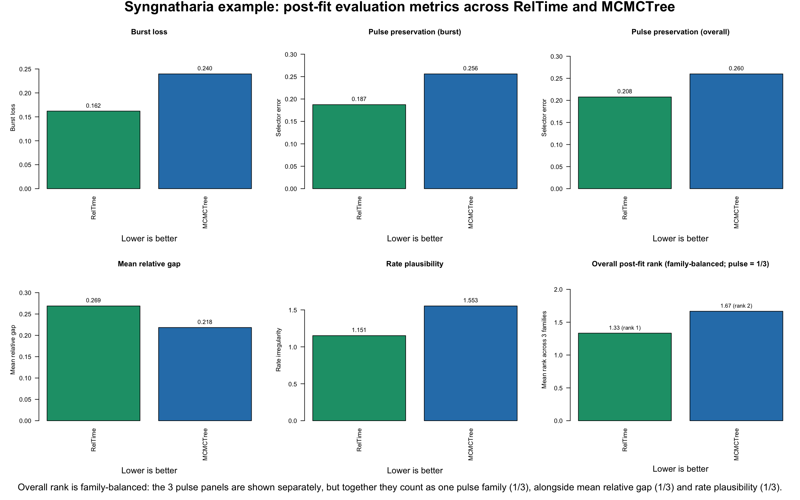

# Post-Fit Evaluation Metrics

This page is about one question: after `clock fitting` and `lambda tuning` are finished, which dated tree looks best biologically?

`Model fitting` and `lambda tuning` answer one question: which chronos settings are favored by the fitting procedure.

`Post-fit evaluation` answers a different question: once those dated trees have been produced, which resulting chronogram is the most biologically defensible. Using both layers helps avoid stopping at fit alone when the competing trees imply different branching rhythm, calibration slack, or rate behavior.

## Three layers

The pipeline treats three things as distinct:

- `clock fitting`: which chronos model is preferred by the fit statistics
- `lambda tuning`: which smoothing strength is preferred within the model search
- `post-fit evaluation`: which final dated tree looks best biologically

This page is about that third layer. It uses three metric families. These are implementation-level diagnostics rather than named published indices; the citations below support the underlying ideas each family is trying to capture.

- `pulse preservation`: asks whether a dated tree keeps the same branching rhythm seen in the source phylogram. In practice, this means preserving clustered speciation bursts and quiet intervals instead of smearing them into evenly spaced splits. In this workflow, the pulse family is reported three ways: `burst loss` is the standalone burst-flattening submetric, `pulse preservation (burst)` is the burst-priority composite selector, and `pulse preservation (overall)` is the balanced composite selector. This follows the literature on extracting diversification tempo from phylogenies and on distinguishing burst-like from unusually regular branching patterns ([Nee et al. 1992](https://doi.org/10.1073/pnas.89.17.8322); [Pybus and Harvey 2000](https://doi.org/10.1098/rspb.2000.1278); [Ford et al. 2009](https://doi.org/10.1093/sysbio/syp018)).

- `gap burden`: asks how much extra unseen lineage history the dated tree implies relative to the calibration evidence. This is the same general idea as ghost-lineage and stratigraphic-congruence measures ([Huelsenbeck 1994](https://doi.org/10.1017/S009483730001294X); [Wills 1999](https://doi.org/10.1080/106351599260148); [O'Connor and Wills 2016](https://doi.org/10.1093/sysbio/syw039)). Lower is usually better, but it should be interpreted carefully: fossils usually provide minimum ages, not true lineage origins, so a tree that minimizes this too aggressively can simply be too young overall ([Parham et al. 2012](https://doi.org/10.1093/sysbio/syr107)).

- `rate plausibility`: asks whether the dated tree implies branchwise rate changes that still look biologically reasonable. It penalizes trees that require rates to become too extreme, too erratic, or too jumpy from parent branch to child branch. This follows the penalized-likelihood and relaxed-clock literature on among-lineage rate variation and autocorrelation ([Sanderson 2002](https://doi.org/10.1093/oxfordjournals.molbev.a003974); [Drummond et al. 2006](https://doi.org/10.1371/journal.pbio.0040088); [Lepage et al. 2007](https://doi.org/10.1093/molbev/msm193); [Ho 2009](https://doi.org/10.1098/rsbl.2008.0729); [Tao et al. 2019](https://doi.org/10.1093/molbev/msz014)).

<details>
<summary><strong>Compact formulas used in the current implementation</strong></summary>

`burst loss`

```text
burst_loss_clade = max(0, (burst_ref - burst_est) / (burst_ref + 1e-12))
mean_burst_loss = weighted mean across matched clades
weight_clade = log(1 + n_tips) * sqrt(n_events)
```

What it means: how much burstiness was flattened away in each matched clade, with larger and more event-rich clades given more weight.

`pulse preservation (overall)`

```text
local_error = 0.35 * mean_emd + 0.55 * mean_burst_loss + 0.10 * mean_centroid_shift
global_error = 0.35 * global_emd + 0.65 * global_burst_loss
pulse_overall = 0.80 * local_error + 0.20 * global_error + 0.20 * (1 - coverage)
```

What it means: a balanced pulse composite combining local clade rhythm, whole-tree rhythm, and how much of the reference pulse panel was actually matched. Here `emd` is the Earth Mover's Distance between relative event-time distributions, and `coverage = matched_clades / panel_clades`.

`pulse preservation (burst)`

```text
local_error_burst = 0.20 * mean_emd + 0.75 * mean_burst_loss + 0.05 * mean_centroid_shift
pulse_burst = 0.80 * local_error_burst + 0.20 * global_error + 0.20 * (1 - coverage)
```

What it means: the same pulse family, but with extra weight placed on keeping burst structure.

`gap layer`

```text
relative_gap_i = (node_age_i - age_min_i) / age_min_i
mean_relative_gap = mean(relative_gap_i)
```

What it means: the average amount of extra inferred lineage history beyond the calibration minima, scaled by the minimum ages. On this page, the Syngnatharia example uses this simple form directly; the Terapontoid example uses the same general logic but behaves as point-calibration slack because its comparisons are point-calibrated.

`rate plausibility`

```text
branch_rate = phylogram_branch_length / dated_branch_duration
rate_irregularity = sd(log_rate) + mean_parent_child_jump + 2 * extreme_rate_frac + autocorr_penalty
autocorr_penalty = 1 - max(rate_autocorr_spearman, 0)
```

What it means: the score rises when branchwise rates are more dispersed, jump more sharply from parent to child, produce more extreme outlier branches, or lose positive autocorrelation.

`overall family-balanced rank`

```text
pulse_family_rank = mean(rank(burst_loss), rank(pulse_burst), rank(pulse_overall))
overall_mean_rank = mean(pulse_family_rank, gap_rank, rate_rank)
```

What it means: pulse contributes `1/3` of the final rank, gap contributes `1/3`, and rate contributes `1/3`.

</details>

## Example 1: Terapontoid

### Fit layer vs post-fit layer

Fit and post-fit point in a similar direction here, but not in exactly the same way. `clock` has the best `PHIIC` in the fit summary. `discrete` has the best penalized log-likelihood and the best overall post-fit rank. So this is not a case where one model wins everything. It is a case where `clock` and `discrete` are the two strongest chronos candidates, but for different reasons.

### Quick takeaway

- `chronos_discrete` is the best overall tree in the Terapontoid post-fit comparison
- `chronos_clock` is a near-tie second and is the best tree for `rate plausibility`
- `treePL` is not the top solution in this example
- `Figure A` is only for the pulse issue; `Figure B` is the broader post-fit comparison

### Figure A: Pulse-layer tree-shape comparison among bundled chronos trees


This figure is useful because it shows the pulse layer directly on the bundled `chronos` trees only; `treePL` is not shown in this panel. It helps explain why `discrete` and `clock` sit at the top of the pulse-preservation ranking. But this panel is only for the pulse issue. It does not show the `gap burden` or `rate plausibility` parts of the broader post-fit comparison.

### Ranked post-fit results (lower is better)

In this Terapontoid example, `gap burden` behaves as `point-calibration slack`, not as fossil-minimum ghost-lineage burden, because the comparison uses point calibrations.

The overall mean rank below is family-balanced. The three pulse summaries are shown separately for transparency, but they are first collapsed into one pulse-family contribution. So pulse as a whole contributes one-third of the final overall rank, while `gap burden` and `rate plausibility` contribute the other two thirds.

| candidate | burst loss | pulse preservation (burst) | pulse preservation (overall) | gap burden | rate plausibility | overall mean rank (pulse = 1/3) |
| --- | ---: | ---: | ---: | ---: | ---: | ---: |
| `chronos_discrete` | `0.1346` | `0.1462` | `0.1603` | `0.0733` | `2.5982` | `1.44` |
| `chronos_clock` | `0.1348` | `0.1464` | `0.1605` | `0.0736` | `2.5861` | `1.78` |
| `chronos_correlated` | `0.1158` | `0.1478` | `0.1722` | `0.1058` | `3.4566` | `3.11` |
| `chronos_relaxed` | `0.1382` | `0.1684` | `0.1949` | `0.1030` | `4.5535` | `4.22` |
| `treePL` | `0.1550` | `0.1604` | `0.1729` | `0.1615` | `3.4631` | `4.44` |

In short: `chronos_discrete` leads both pulse selector summaries and `gap burden`, `chronos_correlated` minimizes the standalone `burst_loss` submetric, and `chronos_clock` leads `rate plausibility`. When pulse is treated as one family contributing one-third of the final score, `chronos_relaxed` edges above `treePL` overall because `treePL` has the highest `gap burden`.

### Figure B: Post-fit comparison across metric families


Figure B uses the same family-balanced rule as the table. Even though three pulse panels are shown, they do not count as three separate thirds. They are averaged into one pulse-family contribution, and that pulse family contributes one-third of the overall rank.

### Interpretation for this example

- `chronos_discrete` is the overall post-fit winner because it leads both pulse summaries and gap burden while staying near-best on rate plausibility
- `chronos_clock` is essentially tied at the top on pulse preservation, nearly tied on gap burden, and is the best tree on rate plausibility
- `chronos_correlated` sits in the middle and is the best tree on standalone `burst_loss`
- `treePL` beats `chronos_relaxed` on the two pulse selectors and on rate plausibility, but it has the highest gap burden in this comparison
- under the family-balanced overall rank, `treePL` drops below `chronos_relaxed` because pulse contributes only one-third of the final score

### Practical decision rule

For the Terapontoid example:

1. If you want one overall post-fit winner, choose `chronos_discrete`.
2. If you want the best implied rate behavior, choose `chronos_clock`.
3. If you care specifically about the standalone burst-flattening penalty, `chronos_correlated` minimizes `burst_loss`.
4. If fit-based selection and post-fit evaluation point to different trees, report both explicitly rather than collapsing them into one claim.
5. In this example, `treePL` is not the leading solution under the post-fit layer, and under family-balanced ranking it places last.

### Files behind this example

The example is split across the pipeline section and this post-fit section.

Pipeline example outputs used here:

- `2_CHRONOS_CUSTOM_DATING_TREE_PIPELINE/EXAMPLE_FILES/OUTPUT_DEMO/summary_terap_empirical_model_fits.csv`
- `2_CHRONOS_CUSTOM_DATING_TREE_PIPELINE/EXAMPLE_FILES/OUTPUT_DEMO/summary_terap_empirical_postfit_metrics.csv`
- the four bundled `chronos` trees in `2_CHRONOS_CUSTOM_DATING_TREE_PIPELINE/EXAMPLE_FILES/OUTPUT_DEMO/`

Post-fit figures and scripts for this section:

- `3_POST_FIT_EVALUATION_METRICS/figures/`
- `3_POST_FIT_EVALUATION_METRICS/scripts/`

## Example 2: Syngnatharia

### Visual choice before metrics

This example is different. It does not start from a chronos fit search. It starts from an earlier paper-level visual comparison among the `RAxML` phylogram, `MCMCTree`, and `RelTime`. In that original comparison, the practical choice was to favor `RelTime` because it visually preserved the diversification bursts in the phylogram better than `MCMCTree`, as discussed in [Santaquiteria et al. 2024](https://www.journals.uchicago.edu/doi/10.1086/733931).

That is the key point of this second example: the choice to prefer `RelTime` came first as a visual judgment. The post-fit metrics are being added here to quantify that older rationale, not to replace it after the fact.

### Quick takeaway

- `RelTime` is the overall post-fit winner in this Syngnatharia comparison
- `RelTime` wins all three pulse summaries and also wins `rate plausibility`
- `MCMCTree` wins the simple calibration-fit layer through lower `mean relative gap`
- `Figure A` is the original visual rationale from the paper; `Figure B` is the quantitative post-fit follow-up

### Figure A: Original visual rationale from the Syngnatharia paper


This is the original paper figure from [Santaquiteria et al. 2024](https://www.journals.uchicago.edu/doi/10.1086/733931) that motivated the visual preference for `RelTime`. The RAxML phylogram on the left shows clustered branching bursts in several parts of the tree. In the middle panel, `MCMCTree` spreads many of those events out more evenly through time. In the right panel, `RelTime` better tracks the burst structure seen in the phylogram. That was the original rationale back then. This panel addresses the pulse issue only. It does not show the calibration-fit layer or the rate-plausibility layer.

### Ranked post-fit results (lower is better)

The overall mean rank below is family-balanced. The three pulse summaries are shown separately for transparency, but they are first collapsed into one pulse-family contribution. So pulse as a whole contributes one-third of the final overall rank, while `mean relative gap` and `rate plausibility` contribute the other two thirds.

| candidate | burst loss | pulse preservation (burst) | pulse preservation (overall) | mean relative gap | rate plausibility | overall mean rank (pulse = 1/3) |
| --- | ---: | ---: | ---: | ---: | ---: | ---: |
| `RelTime` | `0.1620` | `0.1874` | `0.2077` | `0.2689` | `1.1514` | `1.33` |
| `MCMCTree` | `0.2396` | `0.2560` | `0.2600` | `0.2184` | `1.5531` | `1.67` |

### Figure B: Post-fit comparison across metric families



Figure B uses the same family-balanced rule as the table. Even though three pulse panels are shown, they do not count as three separate thirds. They are averaged into one pulse-family contribution, and that pulse family contributes one-third of the overall rank. Here the gap panel is `mean relative gap`, not a penalized burden score.

### Interpretation for this example

- `RelTime` is the overall post-fit winner because it leads all three pulse summaries and also leads `rate plausibility`, while losing only the simple calibration-fit layer
- `MCMCTree` has the lower `mean relative gap`, so it stays closer to the calibration minima on average in this scoring
- the post-fit metrics therefore support, rather than reverse, the original visual rationale from Figure S5: `RelTime` better preserves the branching bursts seen in the RAxML phylogram
- this is exactly the kind of case where a visual choice made before these metrics existed can now be quantified explicitly instead of being left as impression only

### Practical decision rule

For the Syngnatharia example:

1. If you want one overall post-fit winner, choose `RelTime`.
2. If you care most about preserving diversification bursts and smoother implied rate behavior, choose `RelTime`.
3. If you care primarily about the calibration-fit layer alone, `MCMCTree` wins `mean relative gap`.
4. Report the calibration caveat explicitly: here the calibration layer favors `MCMCTree`, even though the broader post-fit layer favors `RelTime`.
5. The original visual choice to favor `RelTime` is supported quantitatively by the current post-fit layer.

### Files behind this example

This example is split across the paper example files and the post-fit outputs.

Example files used here:

- `2_CHRONOS_CUSTOM_DATING_TREE_PIPELINE/EXAMPLE_FILES/Example_Syngna_AmNat/Fig_S5_Burst_preservation.png`
- `2_CHRONOS_CUSTOM_DATING_TREE_PIPELINE/EXAMPLE_FILES/Example_Syngna_AmNat/backbone_Raxml_besttree_matrix75.tre`
- `2_CHRONOS_CUSTOM_DATING_TREE_PIPELINE/EXAMPLE_FILES/Example_Syngna_AmNat/CalibratedTree_backbone_MCMCTree_matrix75_RAXML.tre`
- `2_CHRONOS_CUSTOM_DATING_TREE_PIPELINE/EXAMPLE_FILES/Example_Syngna_AmNat/CalibratedTree_backbone_RelTime_matrix75_RAXML.tre`

Post-fit outputs used here:

- `2_CHRONOS_CUSTOM_DATING_TREE_PIPELINE/EXAMPLE_FILES/Example_Syngna_AmNat/postfit_metrics_out/syngnatharia_postfit_metrics.csv`
- `2_CHRONOS_CUSTOM_DATING_TREE_PIPELINE/EXAMPLE_FILES/Example_Syngna_AmNat/postfit_metrics_out/syngnatharia_fossil_gap_side_by_side.csv`
- `2_CHRONOS_CUSTOM_DATING_TREE_PIPELINE/EXAMPLE_FILES/Example_Syngna_AmNat/postfit_metrics_out/syngnatharia_tableS2_method_audit.csv`
- `3_POST_FIT_EVALUATION_METRICS/figures/syngnatharia_postfit_metric_family_values.png`
- `3_POST_FIT_EVALUATION_METRICS/scripts/make_syngnatharia_postfit_figures.R`
