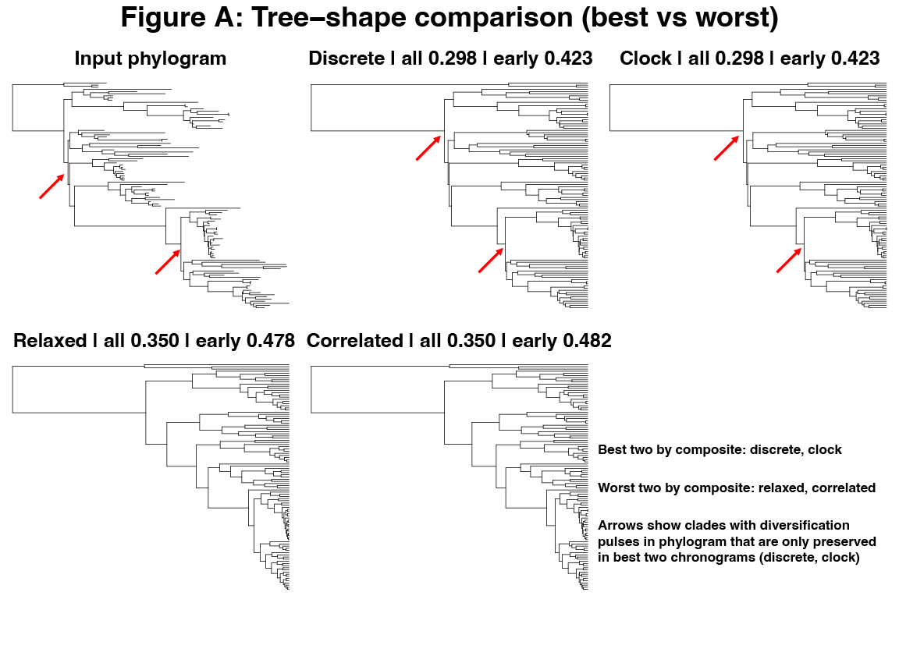
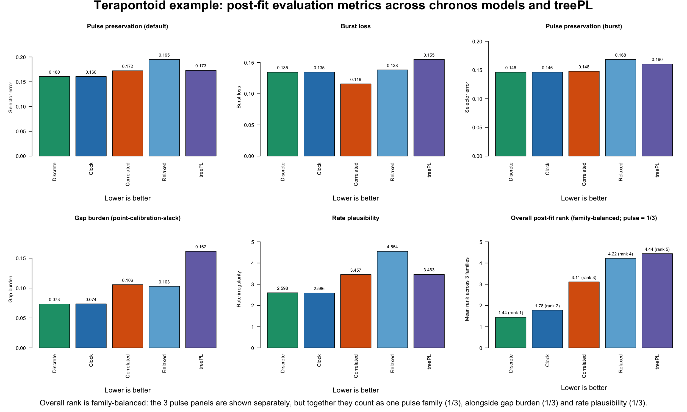

# Post-Fit Evaluation Metrics

Terapontoid example output.

This page is about one question: after `clock fitting` and `lambda tuning` are finished, which dated tree looks best in the Terapontoid example?

`Model fitting` and `lambda tuning` answer one question: which chronos settings are favored by the fitting procedure.

`Post-fit evaluation` answers a different question: once those dated trees have been produced, which resulting chronogram is the most biologically defensible. Using both layers helps avoid stopping at fit alone when the competing trees imply different branching rhythm, calibration slack, or rate behavior.

## Three layers

The pipeline keeps three layers separate:

- `clock fitting`: which chronos model is preferred by the fit statistics
- `lambda tuning`: which smoothing strength is preferred within the model search
- `post-fit evaluation`: which final dated tree looks best biologically

This page is about that third layer. It uses three metric families:

- `pulse preservation`: asks whether a dated tree keeps the same branching rhythm seen in the source phylogram. In practice, this means preserving clustered speciation bursts and quiet intervals instead of smearing them into evenly spaced splits. In this workflow, the pulse family is reported three ways: `pulse preservation (default)` is the balanced composite selector, `burst loss` is the standalone burst-flattening submetric, and `pulse preservation (burst)` is the burst-priority composite selector. This follows the branching-time and diversification-tempo literature (Harvey et al. 1994; Pybus and Harvey 2000; Ford et al. 2009).

- `gap burden`: asks how much extra unseen lineage history the dated tree implies relative to the calibration evidence. This is the same basic idea as ghost-lineage and stratigraphic-congruence measures (Huelsenbeck 1994; Wills 1999; Pol and Norell 2001; O'Connor and Wills 2016). Lower is usually better, but it should be interpreted carefully: fossils usually provide minimum ages, not true lineage origins, so a tree that minimizes this too aggressively can simply be too young overall (Parham et al. 2012). In the Terapontoid example, this behaves as point-calibration slack rather than literal fossil-gap burden.

- `rate plausibility`: asks whether the dated tree implies branchwise rate changes that still look biologically reasonable. It penalizes trees that require rates to become too extreme, too erratic, or too jumpy from parent branch to child branch. This follows the penalized-likelihood and relaxed-clock literature on rate heterogeneity and autocorrelation (Sanderson 2002; Drummond et al. 2006; Lepage et al. 2007; Ho 2009; Tao et al. 2019).

## Terapontoid example: fit layer vs post-fit layer

Fit and post-fit point in a similar direction here, but not in exactly the same way. `clock` has the best `PHIIC` in the fit summary. `discrete` has the best penalized log-likelihood and the best overall post-fit rank. So this is not a case where one model wins everything. It is a case where `clock` and `discrete` are the two strongest chronos candidates, but for different reasons.

## Quick takeaway

- `chronos_discrete` is the best overall tree in the Terapontoid post-fit comparison
- `chronos_clock` is a near-tie second and is the best tree for `rate plausibility`
- `treePL` is not the top solution in this example
- `Figure A` is only for the pulse issue; `Figure B` is the broader post-fit comparison

## Figure A: Pulse-layer tree-shape comparison among bundled chronos trees

This figure is useful because it shows the pulse layer directly on the bundled `chronos` trees only; `treePL` is not shown in this panel. It helps explain why `discrete` and `clock` sit at the top of the pulse-preservation ranking. But this panel is only for the pulse issue. It does not show the `gap burden` or `rate plausibility` parts of the broader post-fit comparison.

## Ranked post-fit results (lower is better)

In this Terapontoid example, `gap burden` behaves as `point-calibration slack`, not as fossil-minimum ghost-lineage burden, because the comparison uses point calibrations.

The overall mean rank below is family-balanced. The three pulse summaries are shown separately for transparency, but they are first collapsed into one pulse-family contribution. So pulse as a whole contributes one-third of the final overall rank, while `gap burden` and `rate plausibility` contribute the other two thirds.

| candidate | pulse preservation (default) | burst loss | pulse preservation (burst) | gap burden | rate plausibility | overall mean rank (pulse = 1/3) |
| --- | ---: | ---: | ---: | ---: | ---: | ---: |
| `chronos_discrete` | `0.1603` | `0.1346` | `0.1462` | `0.0733` | `2.5982` | `1.44` |
| `chronos_clock` | `0.1605` | `0.1348` | `0.1464` | `0.0736` | `2.5861` | `1.78` |
| `chronos_correlated` | `0.1722` | `0.1158` | `0.1478` | `0.1058` | `3.4566` | `3.11` |
| `chronos_relaxed` | `0.1949` | `0.1382` | `0.1684` | `0.1030` | `4.5535` | `4.22` |
| `treePL` | `0.1729` | `0.1550` | `0.1604` | `0.1615` | `3.4631` | `4.44` |

In short: `chronos_discrete` leads both pulse selector summaries and `gap burden`, `chronos_correlated` minimizes the standalone `burst_loss` submetric, and `chronos_clock` leads `rate plausibility`. When pulse is treated as one family contributing one-third of the final score, `chronos_relaxed` edges above `treePL` overall because `treePL` has the highest `gap burden`.

## Figure B: Post-fit comparison across metric families

Figure B uses the same family-balanced rule as the table. Even though three pulse panels are shown, they do not count as three separate thirds. They are averaged into one pulse-family contribution, and that pulse family contributes one-third of the overall rank.

Interpretation for this example:

- `chronos_discrete` is the overall post-fit winner because it leads both pulse summaries and gap burden while staying near-best on rate plausibility
- `chronos_clock` is essentially tied at the top on pulse preservation, nearly tied on gap burden, and is the best tree on rate plausibility
- `chronos_correlated` sits in the middle and is the best tree on standalone `burst_loss`
- `treePL` beats `chronos_relaxed` on the two pulse selectors and on rate plausibility, but it has the highest gap burden in this comparison
- under the family-balanced overall rank, `treePL` drops below `chronos_relaxed` because pulse contributes only one-third of the final score

## Practical decision rule

For the Terapontoid example:

1. If you want one overall post-fit winner, choose `chronos_discrete`.
2. If you want the best implied rate behavior, choose `chronos_clock`.
3. If you care specifically about the standalone burst-flattening penalty, `chronos_correlated` minimizes `burst_loss`.
4. If fit-based selection and post-fit evaluation point to different trees, report both explicitly rather than collapsing them into one claim.
5. In this example, `treePL` is not the leading solution under the post-fit layer, and under family-balanced ranking it places last.

## Files behind this example

The example is split across the pipeline section and this post-fit section.

Pipeline example outputs used here:

- `2_CHRONOS_CUSTOM_DATING_TREE_PIPELINE/EXAMPLE_FILES/OUTPUT_DEMO/summary_terap_empirical_model_fits.csv`
- `2_CHRONOS_CUSTOM_DATING_TREE_PIPELINE/EXAMPLE_FILES/OUTPUT_DEMO/summary_terap_empirical_postfit_metrics.csv`
- the four bundled `chronos` trees in `2_CHRONOS_CUSTOM_DATING_TREE_PIPELINE/EXAMPLE_FILES/OUTPUT_DEMO/`

Post-fit figures and scripts for this section:

- `3_POST_FIT_EVALUATION_METRICS/figures/`
- `3_POST_FIT_EVALUATION_METRICS/scripts/`
