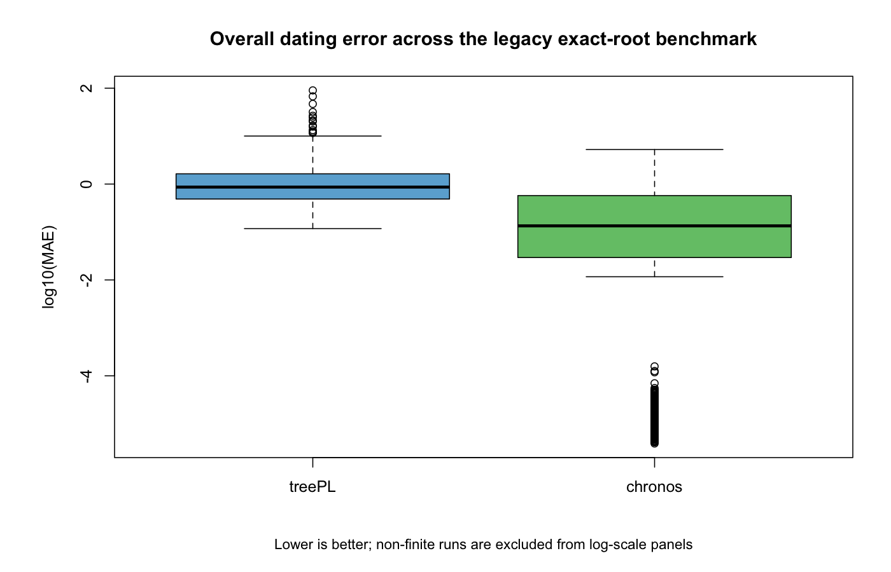
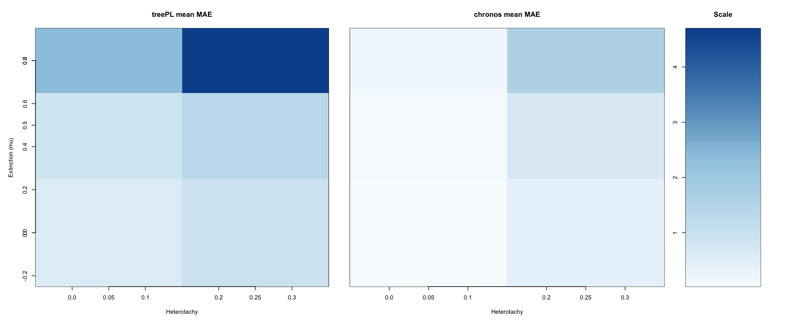
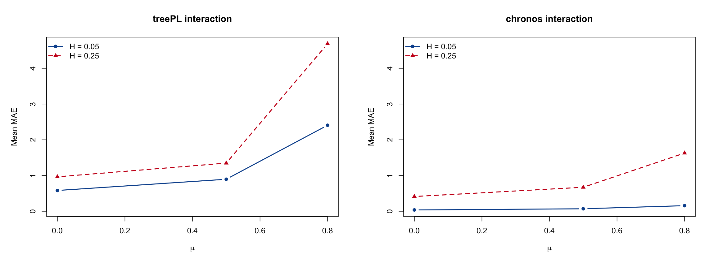
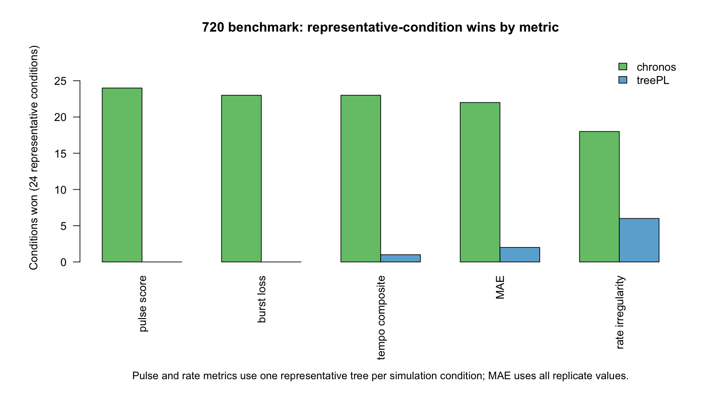
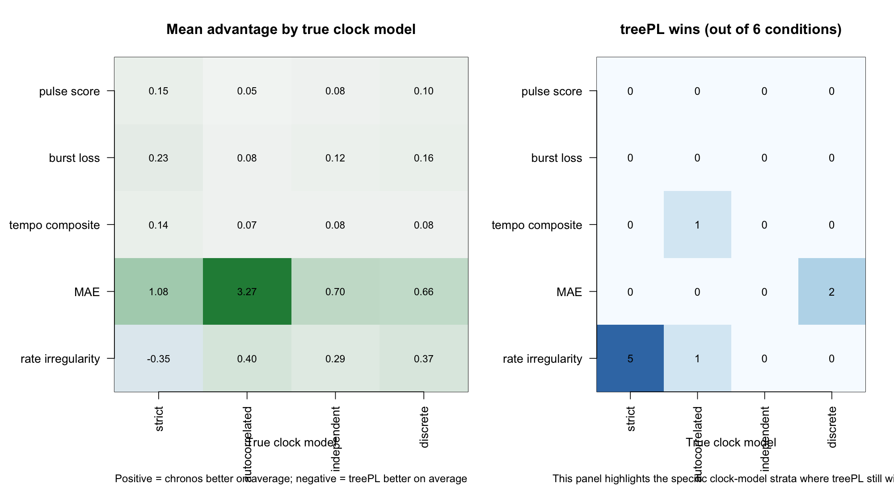

# Benchmark suite: chronos, treePL, and RelTime

This page is now the **main benchmark-suite summary** for `chronos`, `treePL`, and `RelTime`.

This benchmark page is a three-method comparison throughout, with `RelTime` presented on the same footing as `chronos` and `treePL`.

The old exact-root 720-run benchmark was useful, but it is no longer enough on its own. The active benchmark story is now broader:

- `A-E` main benchmarks across different calibration regimes
- `RelTime` included as a full equal, not as an afterthought
- future `P1/P2` extensions for tree-size scaling
- compact `treePL` environment diagnostics (`Tenv`)
- one linked `PCR` section for post-fit interpretation

Final numbers will be plugged in as the current runs finish. The point of this page is to put the **new structure** in place now, so the repo already matches the benchmark we are actually running.

## Benchmark suite

| Benchmark | Purpose | Calibration design | Status |
|---|---|---|---|
| `A` | idealized exact-root benchmark | exact root age only | active |
| `B` | sparse wide-bracket benchmark | root bracket + 5 internal brackets | active |
| `C` | sparse tight-bracket benchmark | root bracket + 5 tight internal brackets | active |
| `D` | sparse minimum-only benchmark | root bracket + 5 internal minimums | active |
| `E` | richer wide-bracket benchmark | root bracket + 10 internal brackets | active |
| `P1` | small-tree extension | same logic on smaller trees | planned |
| `P2` | large-tree extension | same logic on larger trees | planned |

## Reporting layers

This suite keeps four layers separate:

1. `dating accuracy`
   - MAE by method and by benchmark
2. `chronos model behavior`
   - `clock`, `discrete`, `correlated`, and `relaxed` reported separately
3. `treePL environment sensitivity`
   - compact `Tenv` comparison on identical saved bundles
4. `post-fit chronogram plausibility`
   - summarized through the linked `PCR` framework

That separation matters. A method can date well while still recovering clock models poorly. A dated tree can also look plausible or implausible after fitting, which is a different question again. `RelTime` is part of the main dating comparison, not a side method.

## Main figure set

The repo is being reorganized around a compact main figure set:

- `Fig 1`: overall cross-benchmark rank summary across `A-E`
- `Fig 2`: per-benchmark MAE panels with `chronos` split by model, plus `RelTime` and `treePL`
- `Fig 3`: clock-model recovery across benchmarks
- `Fig 4`: representative tree-shape comparison panel with **one row per benchmark (`A-E`)**
- `PCR` figure: compact empirical post-fit summary
- `PCR` table: compact metric/dataset interpretation table

The old single-benchmark figure stack is not the main story anymore, so it is no longer surfaced here.

## What the benchmark is testing

The main benchmark asks:

- when root age is exact, sparse, bracketed, or minimum-only, which method dates best?
- how much does the answer depend on the true clock regime?
- how often does `chronos` recover the correct clock model?
- does `treePL` behave consistently across environments?

The benchmark is therefore no longer just “chronos versus treePL under one favorable setup.” It is now a structured test of **calibration regime**, **clock regime**, **heterotachy**, **extinction**, and later **tree size**.

## Current benchmark outputs to report

The final page will report at least these tables:

- benchmark-level MAE summary across `A-E`
- benchmark-level MAE summary with `RelTime` reported on equal footing
- model-specific `chronos` MAE by benchmark
- clock-model recovery summary by benchmark
- method ranking summary across benchmarks
- compact `PCR` metric table

The expected input layout for those tables and figures is documented in [data/README.md](data/README.md).

## Preliminary live suite snapshot

Current in-progress snapshot used while the full benchmark finishes:

- `A` and `B` are currently being carried by local runs
- `C`, `D`, and `E` are currently being carried by OSCER runs
- values below are provisional and will be replaced by the final drop-in suite tables

| Benchmark | Current source | Completed reps | Current best | MAE | Next best | MAE |
|---|---|---:|---|---:|---|---:|
| `A` | local | `30.00` | `chronos-clock` | `0.02` | `chronos-correlated` | `0.88` |
| `B` | local | `27.22` | `chronos-clock` | `3.52` | `RelTime` | `5.91` |
| `C` | OSCER | `9.97` | `chronos-clock` | `0.43` | `RelTime` | `1.41` |
| `D` | OSCER | `7.00` | `RelTime` | `5.76` | `chronos-clock` | `7.98` |
| `E` | OSCER | `12.28` | `chronos-clock` | `4.89` | `RelTime` | `5.86` |

This is the current three-method benchmark view. The exact-root reference figures below remain useful context, but the active suite now includes `RelTime` as a first-class method.

## Embedded reference figures

### Exact-root benchmark figures

**Fig 1. Overall MAE distribution**

**Fig 2. Mean MAE by true clock regime**

**Fig 3. Mean MAE across extinction and heterotachy**

**Fig 4. Extinction × heterotachy interaction**

## Representative tree panel

`Fig 4` will be a compact multi-row panel:

- one row each for `A`, `B`, `C`, `D`, and `E`
- the same four columns in every row:
  - `reference`
  - `chronos`
  - `RelTime`
  - `treePL`
- intended to show the benchmark-specific shape differences without taking over the whole page

This panel is meant to stay interpretable at a glance. It is not supposed to be a full gallery of every condition.

Current compact reference panel:

## Exact-root reference tables

The exact-root reference file currently in this folder predates the current three-method `A-E` suite, so the summary tables below show the archived `chronos` + `treePL` comparison for that dataset. They remain useful as a reference panel while the new suite-level figures are being filled in.

### By true clock regime

| True clock regime | treePL mean MAE | chronos mean MAE | chronos win rate |
|---|---:|---:|---:|
| `strict` | `1.089` | `0.004` | `1.000` |
| `independent` | `1.132` | `0.436` | `0.850` |
| `discrete` | `1.298` | `0.631` | `0.774` |
| `autocorrelated` | `4.168` | `0.915` | `0.875` |

### By extinction (`mu`)

| `mu` | treePL mean MAE | chronos mean MAE | chronos win rate |
|---|---:|---:|---:|
| `0.0` | `0.754` | `0.226` | `0.894` |
| `0.5` | `1.102` | `0.371` | `0.886` |
| `0.8` | `3.510` | `0.893` | `0.857` |

### By heterotachy

| Heterotachy | treePL mean MAE | chronos mean MAE | chronos win rate |
|---|---:|---:|---:|
| `0.05` | `1.288` | `0.088` | `1.000` |
| `0.25` | `2.419` | `0.905` | `0.738` |

### `chronos` model recovery

| True `chronos` model | Recovered | Recovery rate |
|---|---:|---:|
| `clock` | `179 / 180` | `0.994` |
| `correlated` | `134 / 180` | `0.744` |
| `discrete` | `0 / 180` | `0.000` |
| `relaxed` | `0 / 180` | `0.000` |

## `treePL` environment diagnostic

<strong>Tenv: compact treePL environment diagnostic</strong>

`Tenv` is a small side benchmark used to test whether `treePL` behaves the same way across environments on the **same exact saved input bundles**.

It is not a replacement for the main `A-E` benchmark. It is a targeted diagnostic layer that asks a different question:

- do local and OSCER reruns of the same `treePL` input reproduce one another?
- when they disagree, is the discrepancy mild or catastrophic?

The reporting here should stay compact:

- local vs OSCER summary
- baseline delta summary
- one short interpretation paragraph

Current compact summary:

| Run | Bundles | Mean treePL MAE | Median treePL MAE | Mean delta vs baseline | Mean runtime (s) |
|---|---:|---:|---:|---:|---:|
| `Tenv local` | `36` | `8.84` | `7.27` | `+2.31` | `222.3` |
| `TenvP local` | `36` | `6.65` | `7.27` | `-0.06` | `125.5` |
| `Tenv OSCER` | `36` | `6.36` | `6.34` | `+0.01` | `470.3` |

## `PCR` post-fit interpretation

The benchmark page also needs one compact `PCR` section, because the benchmark and `PCR` answer different but connected questions.

The benchmark asks:

- which method dates better under controlled simulation?

`PCR` asks:

- once trees have been fitted, which chronograms behave more plausibly?

This page will therefore include:

- one `PCR` summary figure
- one `PCR` summary table

The point is not to duplicate the whole `PCR` repo here. The point is to make the link explicit, visible, and interpretable from this benchmark page.

Current exact-root post-fit reference figures:

Current exact-root post-fit reference table:

| Method | Pulse score | Burst loss | Tempo composite | Mean MAE | Rate irregularity |
|---|---:|---:|---:|---:|---:|
| `chronos` | `0.954` | `0.064` | `0.049` | `0.497` | `0.759` |
| `treePL` | `0.857` | `0.212` | `0.143` | `1.924` | `0.939` |

## Future extensions

`P1` and `P2` are reserved for the later tree-size extension. They should be integrated into the same page structure once those runs are ready, not split into separate benchmark pages.

## Figure/data scaffold

The new suite-level figure scaffold lives here:

- [make_benchmark_suite_figures.R](make_benchmark_suite_figures.R)
- [data/README.md](data/README.md)

The exact-root plotting script also remains available for the 720-run dataset:

- [make_figures_and_summary.R](make_figures_and_summary.R)

That script should now be read as a small benchmark utility for `chronos`, `treePL`, and `RelTime`. For any refreshed exact-root rerun, `RelTime` should be present in the input and shown alongside the other two methods; two-method input is only a backward-compatible fallback.

Those files define the expected summary inputs so the final values can be dropped in without another repo redesign.
